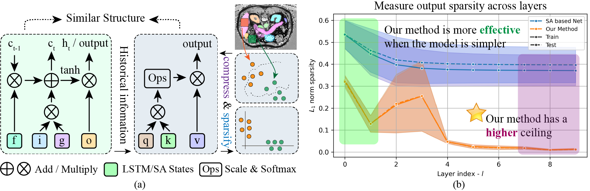

# Sparse Coding Inspired LSTM and Self-Attention Integration for Medical Image Segmentation

## News

- Paper for IEEE Transactions on Image Processing source code is available. (Under Review) [2024.08.06]
- Paper for IEEE Transactions on Image Processing is accepted. [2024.10.13]
- Paper for IEEE Transactions on Image Processing is published:tada: ([link](https://ieeexplore.ieee.org/document/10729728)). [2024.10.28]

## Motivation in One Figure



Two motivations for the deep fusion of LSTM and SA: first, there is an intrinsic similarity in the computation process of LSTM states and the QKV matrices in SA; second, using LSTM can effectively provide enhanced representations of historical information for SA in the process of sparse coding.

## Dataset

In the case of 2D input, we evaluate the performance of our proposed modules on the following datasets:

* Synapse dataset: This dataset comprises multiple organ segmentation tasks. ([link](https://www.synapse.org/\#!Synapse:syn3193805/wiki/217789))
* ISIC2018 dataset: This dataset focuses on the segmentation of skin lesions. ([link](https://challenge.isic-archive.com/landing/2018/))

For the 3D input scenario, we conduct experiments on the following datasets:

* ACDC dataset: This dataset involves the segmentation task of the heart. ([link](https://www.creatis.insa-lyon.fr/Challenge/acdc/))
* CVC-ClinicDB dataset: This dataset pertains to polyp segmentation in colonoscopy videos and has been used for comparing automatic segmentation methods. ([link](https://polyp.grand-challenge.org/CVCClinicDB/))

## Train and Evaluation on Sample Dataset and Baseline presented in the paper

We present the code for the ACDC dataset and the MT-UNet baseline.

You can run the following command to prepare the environment.

- Step 1, prepare the dataset, you can download the ACDC dataset from the [link](https://www.creatis.insa-lyon.fr/Challenge/acdc/) and put the dataset in the `./data/ACDC` folder.
- Step 2, install the required packages by running `pip install -r requirements.txt`.
- Step 3, download the pretrained model SALSTM from the [link](https://drive.google.com/file/d/1i8vX2fZFt4erbSe5iu0fjLRZ7j4LTtgk/view?usp=drive_link) and put the model in the `./code/ACDC/Baseline/checkpoint` folder.
- Step 4, download the pretrained model LSTMSA from the [link](https://drive.google.com/file/d/166k8fyVdvuUdjGPK-DlnCXTWO4Y70Rxe/view?usp=drive_link) and put the model in the `./code/ACDC/Baseline/checkpoint` folder.

After preparing the environment, you project folder should look like this:

```shell
.
├── code
│   └── ACDC
│       └── Baseline
│           ├── checkpoint
│           │   ├── best_model_LSTMSA.pth
│           │   └── best_model_SALSTM.pth
│           ├── dataset.py
│           ├── model.py # The proposed modules are integrated into the model.py file.
│           ├── train.py
│           └── ...
├── data
│   └── ACDC
│       ├── lists_ACDC
│       │   ├── train.txt
│       │   ├── valid.txt
│       │   └── test.txt
│       ├── train
│       │   ├── case_001_sliceED_0.npz
│       │   ├── case_001_sliceED_1.npz
│       │   └── ...
│       ├── valid
│       │   ├── case_019_sliceED_0.npz
│       │   ├── case_019_sliceED_1.npz
│       │   └── ...
│       └── test
│           ├── case_002_volume_ED.npz
│           ├── case_002_volume_ES.npz
│           └── ...
```

Next, you can run the following command to train and evaluate the model.

- Step 5, [Optional] go to `./code/ACDC/Baseline` and run `nohup python -u train.py --model SALSTM > train_SALSTM.log 2>&1 &` to train the model SALSTM. (You can also use the pretrained model to evaluate the model by adding the `--checkpoint` parameter directly.)
- Step 6, [Optional] go to `./code/ACDC/Baseline` and run `nohup python -u train.py --model LSTMSA > train_LSTMSA.log 2>&1 &` to train the model LSTMSA. (You can also use the pretrained model to evaluate the model by adding the `--checkpoint` parameter directly.)
- Step 7, go to `./code/ACDC/Baseline` and run `nohup python -u train.py --model SALSTM --checkpoint "./checkpoint/best_model_SALSTM.pth" --max_epochs 1 > test_SALSTM.log 2>&1 &` to evaluate the model SALSTM.
- Step 8, go to `./code/ACDC/Baseline` and run `nohup python -u train.py --model LSTMSA --checkpoint "./checkpoint/best_model_LSTMSA.pth" --max_epochs 1 > test_LSTMSA.log 2>&1 &` to evaluate the model LSTMSA.

To check whether the results are reproduced, we present the training and evaluation logs in the `./code/ACDC/Baseline` folder, and you can check the results by opening the corresponding log file `train_SALSTM.log` and `train_LSTMSA.log`.

## Train and Evaluation on Other Datasets and Baselines

You need to modify the corresponding code in the baseline to use our proposed modules.
The open source code of baselines is listed as follows:

#### Baseline on Synapse and ACDC datasets

* [TransUNet](https://github.com/Beckschen/TransUNet)
* [MT-UNet](https://github.com/Dootmaan/MT-UNet)
* [MISSFormer](https://github.com/ZhifangDeng/MISSFormer)
* [DAEFormer](https://github.com/mindflow-institue/DAEFormer)
* [MERIT](https://github.com/SLDGroup/MERIT)

#### Baseline on ISIC2018 dataset

* [UNet](https://github.com/TomAndHelen/UNet_Family)
* [ResUNet](https://github.com/TomAndHelen/UNet_Family)
* [DWUNet](https://github.com/TomAndHelen/UNet_Family)
* [UNet++](https://github.com/TomAndHelen/UNet_Family)
* [DCSAU-Net](https://github.com/xq141839/DCSAU-Net)

#### Baseline on CVC-ClinicDB dataset

* [FCBFormer](https://github.com/ESandML/FCBFormer)
* [SSFormer-L](https://github.com/Qiming-Huang/ssformer)
* [HarDNet-DFUS](https://github.com/YuWenLo/HarDNet-DFUS)
* [FANet](https://github.com/feinanshan/FANet)
* [ESFPNet](https://github.com/dumyCq/ESFPNet)
